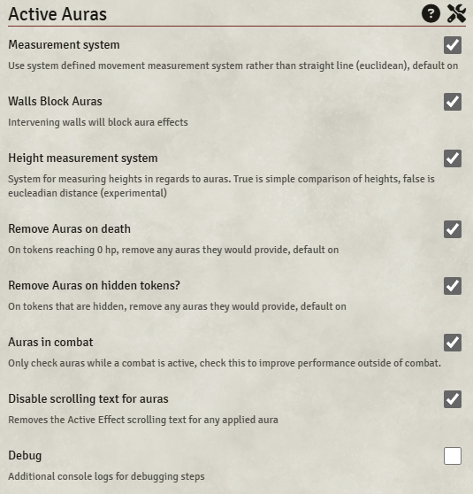

# Active Auras

**Version:** 0.12.2  
**Used In:** All Worlds  
**Purpose:** Enables automatic aura-based effects from tokens — buffs, conditions, etc.

## Configuration Snapshot

## Notes

- All visible settings appear to be at their default values.
- Screenshot is used to detect future changes across version updates.

## Related Modules

- [[MidiQOL]] – often paired with this for effect application (5e only)
- [[DFreds Convenient Effects]] – for predefined conditions

## Tasks

- [ ] When updating module, compare settings screen to this snapshot

