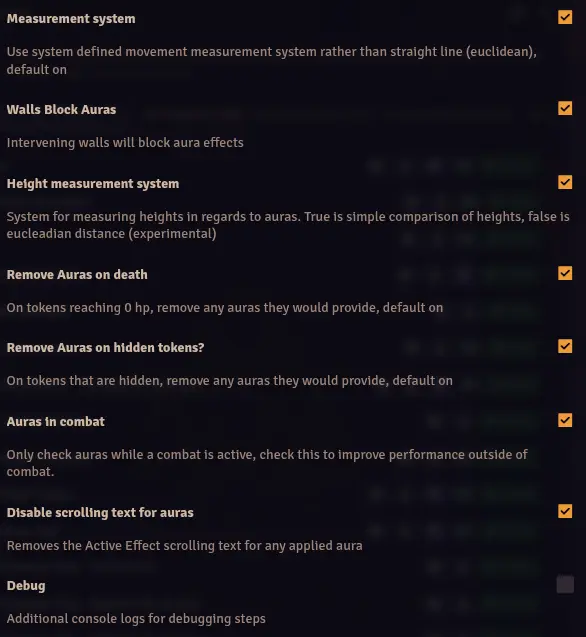

# Active Auras

**Version:** 0.12.7
**Used In:** 5e-high-automation
**Purpose:** Enables automatic aura-based effects from tokens — buffs, conditions, etc.

## Configuration Snapshot

## Notes

- Automation, largely tied to DAE which is not in use but useful for things like Paladin's Aura of Protection

