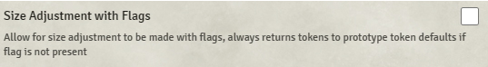

# Active Token Effects

**Version:** 0.8.1  
**Used In:** All Worlds  
**Purpose:** Displays icons and effects on tokens based on active effects, often used with DFreds modules.

## Configuration Snapshot

## Configuration Notes

- The only available setting is **"Size Adjustment with Flags"**, which is currently **disabled** (default state).
- No other settings are present.
- Defaults appear sufficient for current use cases.

## Maintenance & Relevance

- ✅ Actively maintained as of May 2025.
- ⚠️ Not strictly required if you're not using **DFreds Convenient Effects**. 
- 🧭 Continue using unless a visual effect system supersedes this (none currently known).

## Related Modules

- [[DFreds Convenient Effects]] – applies conditions and statuses that this module visualizes

## Tasks

