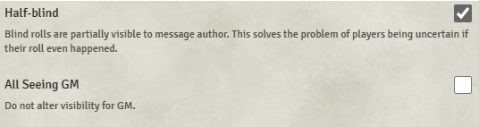

# Actually Private Messages

**Version:** 1.4  
**Used In:** All Worlds  
**Purpose:** Enhances privacy and control over chat messages, especially for blind rolls or whispers.

## Configuration Snapshot

## Configuration Notes

- ✅ **"Half-blind" is enabled** — this allows players to see that their blind roll happened, even if they can't see the result.
- ☐ **"All Seeing GM" is disabled** — maintains the default behavior where the GM’s visibility is affected by this module.
- No other configuration options are available in this version.

## Maintenance & Relevance

- ✅ Still maintained and functioning under Foundry V12.
- 🧭 Remains useful even without DAE or MidiQOL.
- Provides a better player experience by resolving common confusion around blind rolls.
- 🧹 Lightweight and non-intrusive — fits well with “simple is better” philosophy.

## Related Modules

- [[Cautious Gamemaster's Pack]] – historically used for similar privacy features, now partially redundant.
- [[DFreds Convenient Effects]] – sometimes paired with blind roll workflows for condition applications.

## Tasks

- [x] Capture config screenshot and commit as `ActuallyPrivateMessages-v1.4.png`
- [ ] Re-evaluate if chat handling in core Foundry changes in v13+
