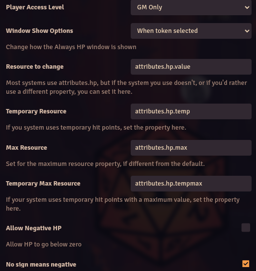
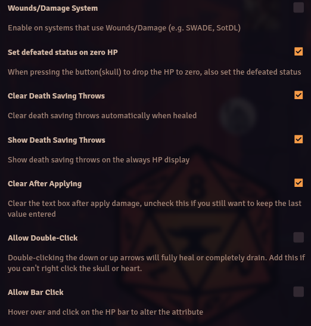
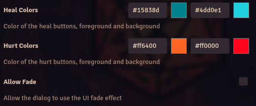

# Always HP

**Version:** 13.04
**Used In:** 5e-All, ToV-All
**Purpose:** Displays a token’s current HP and death saving throws in a persistent, easily accessible overlay. Useful for GM visibility and quick status updates. Death Saves are clearly a 5e rule, so unclear how that functionality works for other game systems.

## Configuration Snapshot

## Notes

- **Load Option:** GM Only
- **Window Show Options:** When token selected
- **Resource to change:** `attributes.hp` (default for 5e systems)
- ✅ "No sign means negative" – enabled for intuitive input
- ☐ "Wounds/Damage System" – disabled (not using systems like SWADE)
- ✅ "Set defeated status on zero HP" – enabled
- ✅ "Clear Death Saving Throws" – enabled
- ✅ "Show Death Saving Throws" – enabled
- Presumably works will all game systems, but only tested so far with 5e and ToV

## Related Modules

- [[Cautious Gamemaster's Pack]] – overlaps slightly in GM visibility features

## Tasks

- [ ] Investigate how well it works with Tales of the Valiant, Nimble, and Daggerheart
