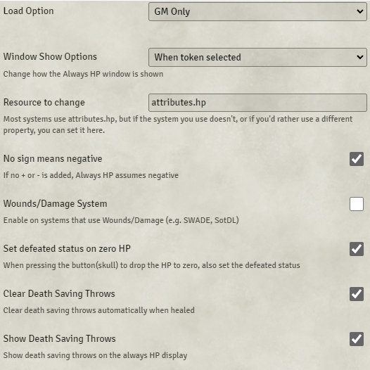

# Always HP

**Version:** 12.01  
**Used In:** All Worlds  
**Purpose:** Displays a token’s current HP and death saving throws in a persistent, easily accessible overlay. Useful for GM visibility and quick status updates.

## Configuration Snapshot

## Configuration Notes

- **Load Option:** GM Only
- **Window Show Options:** When token selected
- **Resource to change:** `attributes.hp` (default for 5e systems)
- ✅ "No sign means negative" – enabled for intuitive input
- ☐ "Wounds/Damage System" – disabled (not using systems like SWADE)
- ✅ "Set defeated status on zero HP" – enabled
- ✅ "Clear Death Saving Throws" – enabled
- ✅ "Show Death Saving Throws" – enabled

These settings appear well-tuned for D&D 5e under Foundry V12, supporting the simplified system without relying on DAE or MidiQOL.

## Maintenance & Relevance

- ✅ Confirmed compatible with Foundry V12
- 🧭 Lightweight and effective alternative to heavy combat automation tools
- 💡 Useful for both the GM and players if visibility settings are adjusted
- 🔧 No known replacements that integrate as cleanly with native death saves

## Related Modules

- [[DFreds Convenient Effects]] – can complement this for visual conditions
- [[Cautious Gamemaster's Pack]] – overlaps slightly in GM visibility features

## Tasks

- [x] Capture and commit screenshot as `AlwaysHP-v12.01.png`
- [ ] Consider exposing Always HP to players if you want them tracking death saves visually
