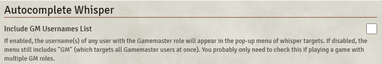

# Autocomplete Whisper

**Version:** 1.0.6  
**Used In:** All Worlds  
**Purpose:** Enables autocompletion of user names when typing `/w` (whisper) commands in chat.

## Configuration Snapshot

## Configuration Notes

- ☐ **"Include GM Usernames List"** is **disabled** — default state.
- Autocomplete includes “GM” by default, which targets all GM-role users.
- The setting is only needed if multiple GMs are actively playing, which is not the case in current campaigns.

## Maintenance & Relevance

- ✅ Still works in Foundry V12 without issue.
- 💬 Lightweight quality-of-life tool for chat-based games.
- 🧭 Especially useful during roleplay scenes or mystery-heavy sessions where players whisper often.

## Related Modules

- [[Actually Private Messages]] – for privacy and blind roll behavior
- [[Chat Portrait]] – improves whisper readability when combined with avatars

## Tasks

- [x] Capture screenshot as `AutocompleteWhisper-v1.0.6.png`
- [ ] Optional: test autocomplete behavior with guest or alt user
