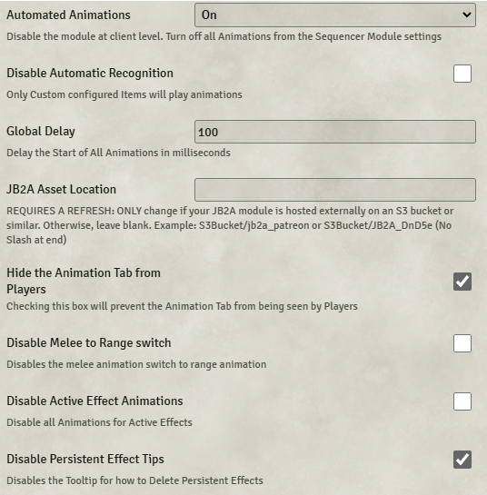
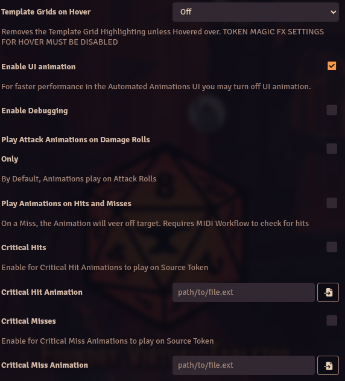

# Automated Animations (AA)

**Version:** 5.1.4  
**Used In:** 5e-Dev 
**Purpose:** Adds dynamic, triggered animations to attacks and effects, primarily leveraging the JB2A asset library.

## Configuration Snapshots

  

## Configuration Notes

- **Automated Animations:** Enabled
- ☐ Disable Automatic Recognition – left off to allow default triggers
- 🔢 Global Delay: `100ms`
- ☐ Custom Asset Location – not used; default JB2A installation applies
- ✅ Hide Animation Tab from Players – enabled
- ☐ Disable Melee to Range Switch – disabled
- ☐ Disable Active Effect Animations – disabled
- ✅ Disable Persistent Effect Tips – enabled

### Second Page:
- **Template Grids on Hover:** Off
- ✅ Enable UI Animation – enabled for better interface visuals
- ☐ Enable Debugging
- ✅ Play Attack Animations on Damage Rolls Only – enabled
- ☐ Play on Hits and Misses – disabled (requires MidiQOL, which is not used)
- ☐ Critical Hit and Miss animations – not configured

## Maintenance & Relevance

- ✅ Maintained and compatible with Foundry V12
- ⚠️ Full functionality often assumes **MidiQOL** or **DAE**, which are not in use
- 🧭 You use it selectively for visual flair without deep automation, which aligns with your simplified system
- ⚡ JB2A’s high-quality animations remain valuable for showcasing spells, weapons, and scene events

## Related Modules

- [[JB2A]] – provides the animation assets
- [[Sequencer]] – required for animation chaining (assumed installed)
- [[Token Magic FX]] – complementary but not required
- [[MidiQOL]] – no longer installed; disables hit/miss features

## Tasks

- [x] Capture screenshots of both config pages
- [ ] Review JB2A usage: do any scenes feel over-animated or slow?
- [ ] Test compatibility with Foundry V13 later this year
