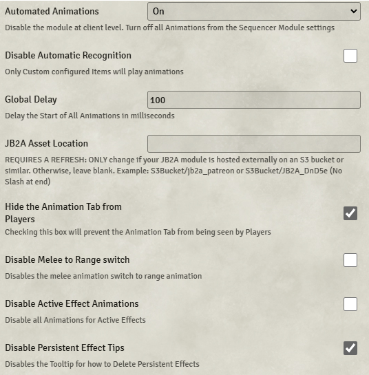
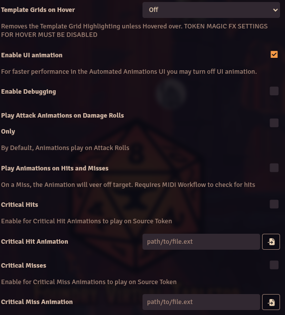

# Automated Animations (AA)

**Version:** 6.8.1
**Used In:** 5e-Dev 
**Purpose:** Adds dynamic, triggered animations to attacks and effects, primarily leveraging the JB2A asset library.

## Configuration Snapshots

  

## Configuration Notes

- Custom Asset Location – not used; default JB2A installation applies
- **Template Grids on Hover:** Off
- ✅ Enable UI Animation – enabled for better interface visuals
- ✅ Play Attack Animations on Damage Rolls Only – enabled
- ☐ Play on Hits and Misses – disabled (requires MidiQOL, which is not used)

## Notes

- Full functionality often assumes **MidiQOL** or **DAE**, which are not in use

## Related Modules

- [[JB2A]] – provides the animation assets
- [[Sequencer]] – required for animation chaining (assumed installed)
- [[Token Magic FX]] – complementary but not required
- [[MidiQOL]] – no longer installed; disables hit/miss features

## Tasks

- None
