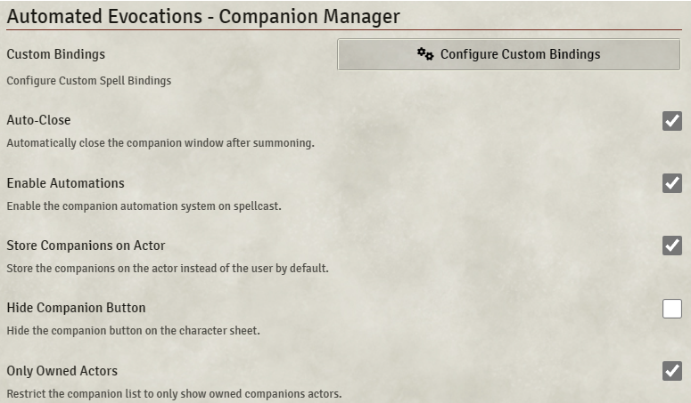

# Automated Evocations – Companion Manager

**Version:** 5.0.0  
**Used In:** 5e-All
**Purpose:** Streamlines the summoning and management of companions, familiars, or spiritual weapons using a customizable interface and automation.

## Configuration Snapshot

## Notes

- ⚙️ **Custom Bindings** available – not currently customized
- ✅ **Auto-Close** – closes companion window after summoning
- ✅ **Enable Automations** – automates effects when casting summoning spells
- ✅ **Store Companions on Actor** – stores companions on the player’s actor rather than user
- ☐ **Hide Companion Button** – disabled (players can see it)
- ✅ **Only Owned Actors** – restricts companion selection to owned actors
- Works well alongside [[Automated Animations]] for summoning visuals
- This setup strikes a balance between automation and control, giving players a clear UI for managing their summons while ensuring performance and consistency.

## Related Modules

- [[Sequencer]] – supports visual chaining for summoned tokens

## Tasks

- None
