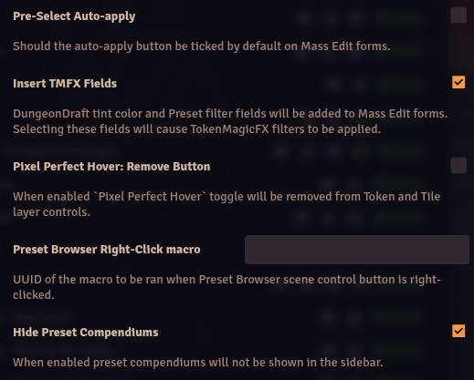

# Baileywiki – Mass Edit

**Version:** 2.7.8
**Used In:** Agnostic-Dev
**Purpose:** Enhances editing workflows by enabling rapid adjustment of multiple tiles, drawings, or placeables at once. Provides a searchable index of all assets.

## Configuration Snapshot

## Notes

- ☐ **Single Placeable: Default Config** – disabled to retain modified config behavior
- ☐ **Allow Manual Input for Range Sliders** – disabled; sliders remain visual
- 🔢 **Pixel Perfect Hover Alpha Threshold:** `0.75`
- ✅ **Scene Controls: Preset Button** – adds quick access to tools
- ✅ **Auto-snap Coordinates to Grid** – improves grid alignment during scene setup
- ✅ **Pan to Search Target** – centers on first found item
- ☐ **Pre-Select Auto-Apply** – disabled for manual control
- Used only during scene prep — not needed in active gameplay worlds
- Should be disabled or uninstalled in live game worlds to reduce overhead

## Related Modules

- [[Baileywiki Maps Premium]] – content packs that this tool is often used to manipulate
- [[Tile Scroll]] and [[Multiface Tiles]] – modules that benefit from bulk tile controls

## Tasks

- None
