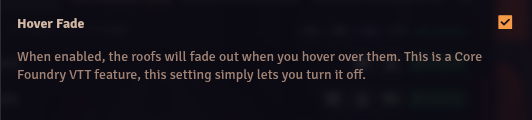

# Better Roofs

**Version:** 3.0.0
**Used In:** Agnostic-All
**Purpose:** A utility module for enchancing overhead tile functionality

## Configuration Snapshot

## Notes

- From Ripper's wiki: Keep in mind that this settings works of the Vision Range of the token, if the token has no Vision Range or Vision disabled the roof will not show.
- Any world where there are overhead tile roofs in Scenes.

## Related Modules

- None

## Tasks

- None