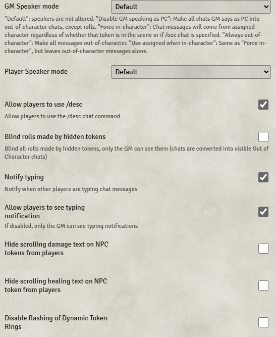

# Cautious Gamemaster's Pack

**Version:** 1.10.2  
**Used In:** All Worlds  
**Purpose:** Enhances chat and GM visibility features. You currently use this module **exclusively for the typing notification functionality**, which is not available in Foundry core.

## Configuration Snapshot

## Configuration Notes

- ✅ **Notify Typing** – enabled
- ✅ **Allow players to see typing notification** – enabled (players also benefit)
- ✅ **Allow players to use /desc** – enabled
- July 2025 - changed settings to stop displaying scrolling healing text on NPCs to players

This minimal setup supports social communication and accessibility in games, particularly useful when players have unreliable audio/video or type long chat messages.

## Maintenance & Relevance

- ✅ Still maintained and compatible with Foundry V12
- 🧠 Solves a real issue not handled by core Foundry
- 💡 Lightweight — fits your low-friction setup philosophy
- 🧭 Should remain installed as long as you value typing visibility during roleplay or troubleshooting

## Related Modules

- [[Actually Private Messages]] – for whisper visibility
- [[Autocomplete Whisper]] – complements typed communication

## Tasks

- [x] Capture and commit screenshot as `CautiousGamemasterPack-v1.10.2.png`
- [ ] Periodically review if typing indicator becomes core Foundry feature
