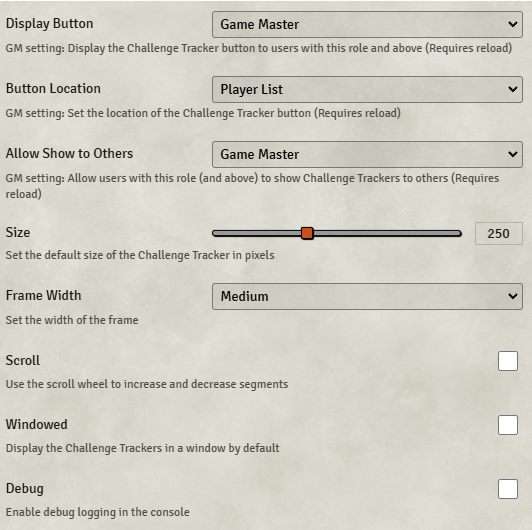

# Challenge Tracker

**Version:** 3.0.0
**Used In:** Agnostic-All
**Purpose:** Provides a visible tracker for progress-based challenges such as skill checks, countdowns, or quest progression.

## Configuration Snapshot

## Notes

- Additional settings exist to change color settings for the success and failure rings
- Only use when needed. Typically enabled only when running challenges with visible progress (e.g., chasing a fleeing foe, sealing a portal, or group survival rolls)
- Used occasionally during Skill Challenges or time-sensitive segments 

## Related Modules

- Adds Color Picker as a dependency. No configuration settings are available for Color Picker

## Tasks

- None
