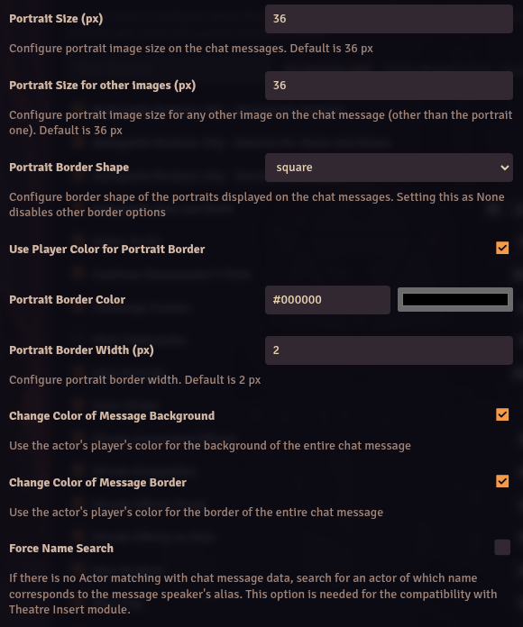
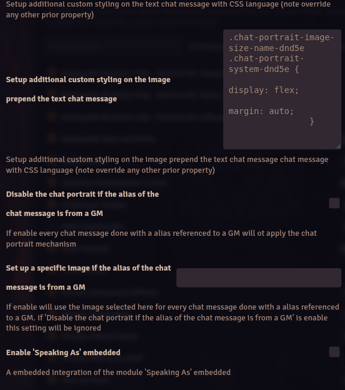

# Chat Portrait

**Version:** 13.01
**Used In:** 5e-All, ToV-All
**Purpose:** Adds visually distinct portraits and player-colored message styling to the chat window, improving readability and enhancing roleplay immersion.

## Configuration Snapshots

- 
- 
- 
- 
- 
- 

## Notes

- **Disable Chat Portrait** – select this option for 5e games. If not selected for 5e, there will be two tokens in the chat box
- Two additional screenshots are inclued in the repo to show of applying the config changes to this module. These are used in the "Did You Know #1" documentation
	- ./ChatCardClean.png
    - ./ChatCardDefault.png

## Related Modules

- None

## Tasks

- [ ] Need to understand if Daggerheart and Nimble need "Disable chat portrait" selected or not
