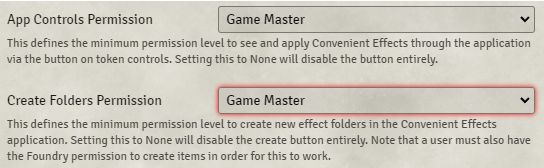

# DFreds Convenient Effects

**Version:** 8.1.3
**Used In:**  5e-All
**Purpose:** Provides an easy, searchable, and organized interface for applying conditions, states, and effects to tokens — replacing more complex automation systems like DAE.

## Configuration Snapshot

## Notes

- **App Controls Permission:** Game Master
  - Only GMs see and use the effects UI through token controls
- **Create Folders Permission:** Game Master
  - Only GMs can create new folders for organizing effects

## Related Modules

- None

## Tasks

- [ ] See if it can work with Tales of the Valiant as well