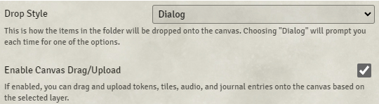

# DFreds Droppables

**Version:** 4.0.4
**Used In:** Dev World (Scene prep and drop-based interaction)  
**Purpose:** Enables GMs to drag and drop rich content (tokens, tiles, audio, journal entries, lights, and more) directly onto the canvas from folders or compendiums.

## Configuration Snapshot

## Configuration Notes

- **Drop Style:** Dialog  
  - Prompts the GM each time an item is dropped — allows flexibility
- ✅ **Enable Canvas Drag/Upload**  
  - Dragging is enabled for all supported drop types

## Supported Drop Targets

This module supports the following assets for drag-and-drop onto the canvas:

- **Tokens** – instantly spawn an actor onto the scene
- **Tiles** – place decorative or functional graphics
- **Journal Entries** – drop clickable hotspots, scene lore, or GM notes
- **Audio Files** – embed environmental audio or one-shot effects
- **Lights** – add preset lighting configurations quickly
- **Measured Templates** – place spell cones, radii, etc.
- **Drawings** – drop annotated shapes or fog areas
- **Playlists/Sounds** – ambient scene control (if supported)

## Advanced Usage Ideas

- Create folders like `📁 Lighting Presets`, `📁 Summonable Creatures`, or `📁 Interactive Notes`
- Store reusable elements to quickly drop into multiple scenes
- Use dialog mode to choose layer or settings when dropping
- Combine with DFreds macro work to streamline GM scene setup

## Maintenance & Relevance

- ✅ Maintained and compatible with Foundry V12
- 🧠 Low overhead, high flexibility — worth keeping for prep use
- 🧭 Ideal for Dev World even if not needed in live play

## Related Modules

- [[DFreds Convenient Effects]] – shared author and polish
- [[Challenge Tracker]] – could drop journal-based objectives or timers
- [[Automated Animations]] – combined with token drops for dramatic entrances

## Tasks

- [x] Capture screenshot as `DFredsDroppables-v2.1.0.png`
- [x] Document extended capabilities (lights, templates, drawings, etc.)
- [ ] Create test folders for preset drops and see what sticks
