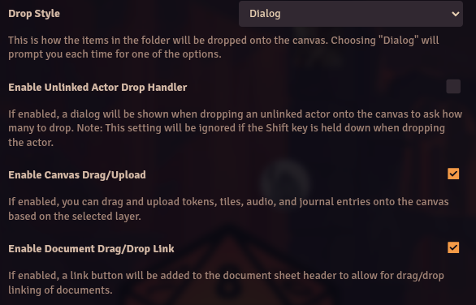

# DFreds Droppables

**Version:** 5.3.0
**Used In:** Agnostic-Dev 
**Purpose:** Enables GMs to drag and drop rich content (tokens, tiles, audio, journal entries, lights, and more) directly onto the canvas from folders or compendiums.

## Configuration Snapshot

## Notes

- **Drop Style:** Dialog  
  - Prompts the GM each time an item is dropped — allows flexibility
- ✅ **Enable Canvas Drag/Upload**  
  - Dragging is enabled for all supported drop types
- Most of the functionality of this module is superceded by [[BaileywikiMassEdit]]

## Related Modules

- [[DFreds Convenient Effects]] – shared author and polish
- [[Challenge Tracker]] – could drop journal-based objectives or timers
- [[Automated Animations]] – combined with token drops for dramatic entrances

## Tasks

- [ ] Evaluate whether it is really needed. Nuke by 31Jan2026 if not being used on Dev servers
