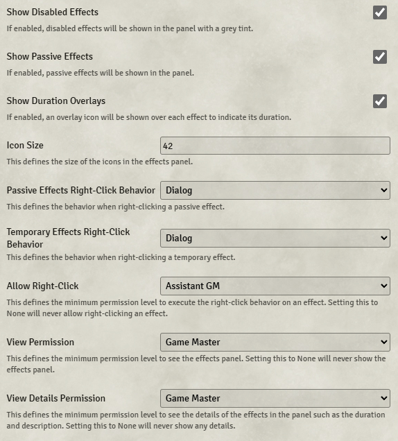

# Torch

**Version:** 4.1.2
**Used In:** All Worlds  
**Purpose:** Adds a transparent panel in the top-right corner displaying any effects currently applied to the selected token(s).

## Configuration Snapshot

## Configuration Notes

- Currently configured so just GM and Assistant GM can see the Effects panel
