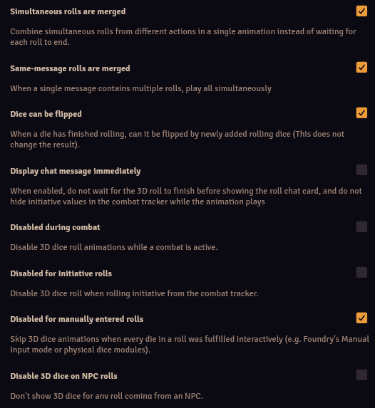
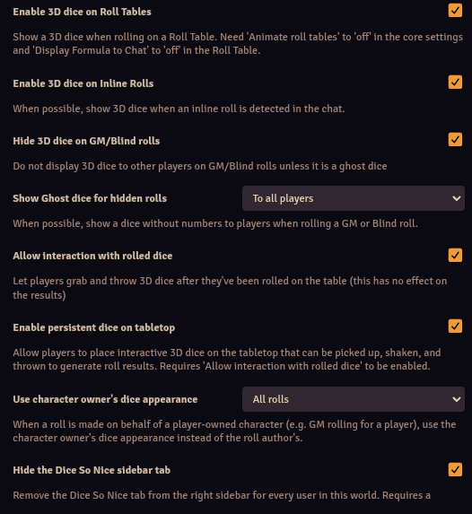
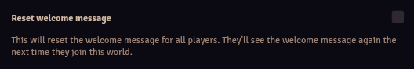

# Dice So Nice

**Version:** 6.2.9
**Used In:** All Worlds  
**Purpose:** Provides 3D animated dice for rolls in Foundry. Enhances immersion and clarity in both in-person and remote games.

## Configuration Snapshots

- 
- 
- 

## Configuration Notes

- **Max Number of Dice:** 20
- **Global Animation Speed:** Players’ choice (respects individual settings)
- ✅ Simultaneous and same-message rolls are merged
- ✅ Dice can be flipped post-roll
- ✅ Use owner dice for initiative
- ✅ Enable 3D dice on:
  - Roll Tables
  - Inline Rolls
  - Player Rolls
- ✅ Ghost dice enabled for hidden rolls, visible to **all players**
- ✅ Allow interaction with rolled dice
- ☐ Disabled during combat — not in use
- ☐ Display chat immediately — messages wait for animation

