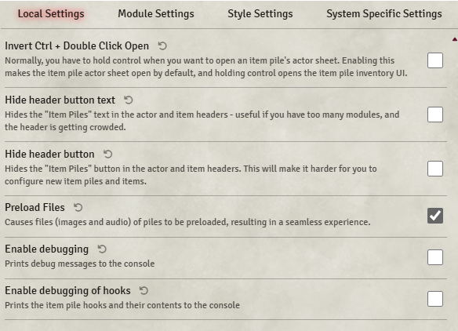
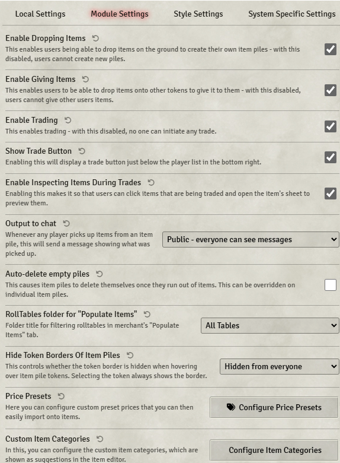
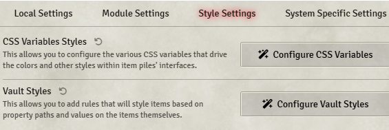
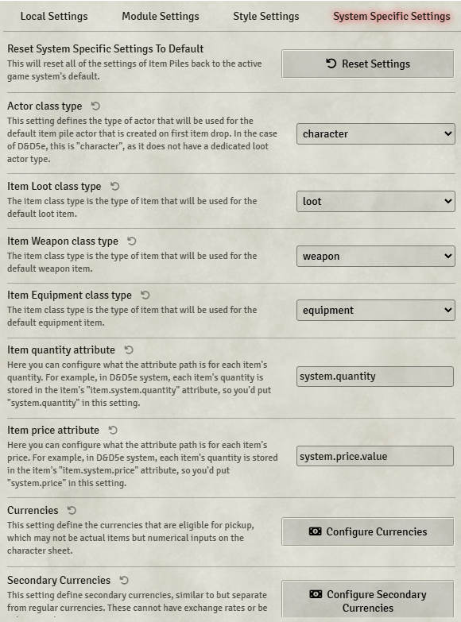

# Item Piles

**Version:** 3.3.4
**Used In:** All Worlds  
**Purpose:** Adds interactive containers (e.g., chests, corpses, loot drops) and merchant functionality to the game. Supports trading, inventory inspection, and drop-based item creation.

## Configuration Snapshots

- 
- 
- 
- 

## Configuration Notes

A system-specific module is required for whatever game is playing. The 5e and ToV modules are known to work but I haven't worked with other games yet. 
