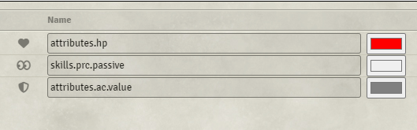
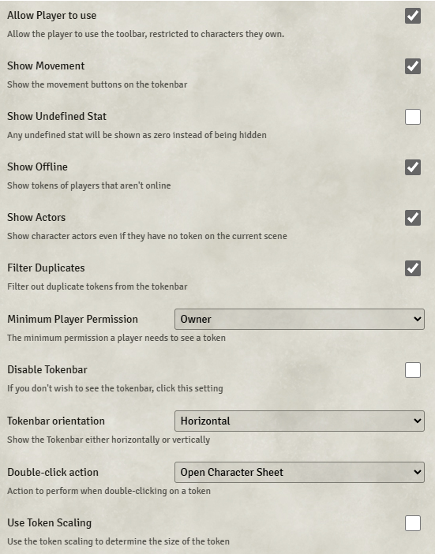
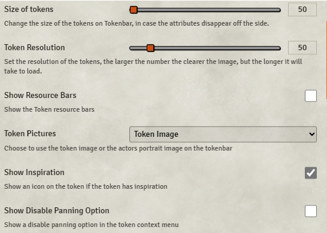
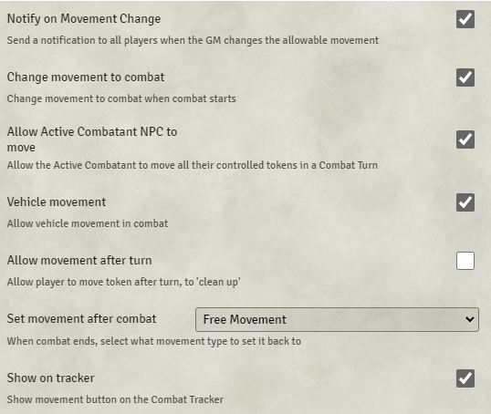
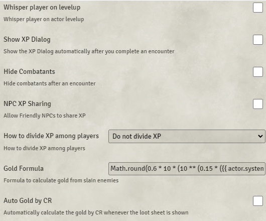
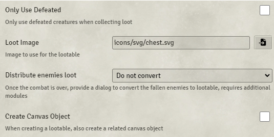
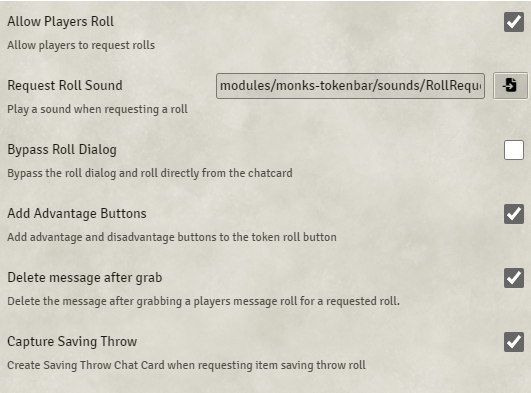

# Monk's Token Bar

**Version:** 12.04
**Used In:** All Worlds  
**Purpose:** Displays a customizable overlay of tokens at the top/bottom of the screen, with HP, AC, Passive Perception, and quick-access buttons. Essential for fast GM monitoring.

## Configuration Snapshots

- 
- 
- 
- 
- 
- 
- 

## Key Configurations

- ✅ **HP, Passive Perception, AC** tracked visibly
- ✅ **Show Inspiration Icon** — quickly see who has it
- ✅ **Allow Players to Use** — limited to characters they own
- ✅ **Movement buttons and initiative linking**
- ✅ **GM XP & loot formulas** (disabled by default but visible)
- ✅ **Auto Gold by CR** off for now (could be used with Item Piles)
- ✅ **Roll Request Features**:
  - Advantage/Disadvantage buttons
  - Capture Saving Throws
  - Delete messages after grab
  - Sound effect on roll request

## Commentary

- Excellent utility for real-time GM awareness of the party’s key stats
- Roll request flow is clean and unobtrusive
- Could be further enhanced by enabling **Show Resource Bars** (disabled)
- XP, Gold, and Loot features are available if tighter economy or automation is desired

---

## Tasks

- [x] Capture settings and screenshots
- [ ] Consider enabling `Show Resource Bars` or `Auto Gold by CR` depending on campaign tone
