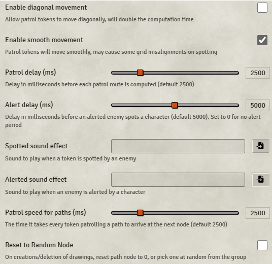

---

category: automation
status: active
scope: all worlds
-----------------

# Patrol

**Version:** 2.0.4
**Used In:** All Worlds
**Purpose:** Automates patrol routes for tokens, allowing the GM to create stealth scenarios and reactive enemy patrols with optional alerting logic. Tokens follow waypoints and can respond to sighting players.

## Configuration Snapshot

## Configuration Notes

* ✅ **Enable diagonal movement:** Disabled — limits movement to straight lines, simplifying patrol paths and reducing overhead.
* ✅ **Enable smooth movement:** Enabled — adds fluidity to patrol transitions.
* ✅ **Patrol delay (ms):** 2500 — pause between recalculations of patrol path.
* ✅ **Alert delay (ms):** 5000 — time before a token reacts after spotting a player.
* ✅ **Patrol speed for paths (ms):** 2500 — controls animation speed between nodes.
* ☐ **Spotted/Alerted sound effects:** Not set — can optionally add sounds for added atmosphere.
* ☐ **Reset to Random Node:** Disabled — patrols always restart at the first node.

## Usage Notes

Patrol is particularly useful for stealth encounters, break-ins, or guard-route gameplay. Tokens can patrol autonomously and react to player detection with configurable delays and optional effects. Perfect for scenes like Vaultbreaker! or guarded fortresses.

## Maintenance & Relevance

* ✅ Compatible with Foundry V12
* 🧠 Enables dynamic exploration challenges with little GM effort once set up
* 🔄 Consider creating token templates for reusable patrol paths

## Tasks

* [x] Capture screenshot of current settings
* [ ] Evaluate adding sound effects for alerted states
* [ ] Document example patrol setups for reusable encounter design
