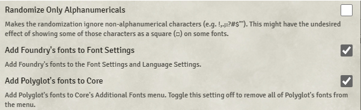
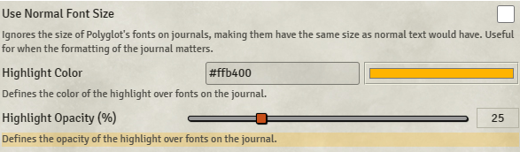
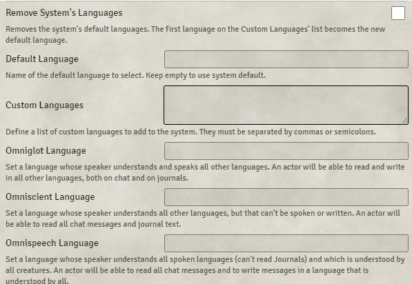
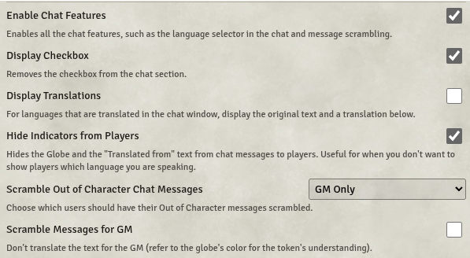
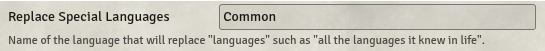

# Polyglot

**Version:** 2.4.22  
**Used In:** All Worlds  
**Purpose:** Adds immersive multilingual support to Foundry, allowing for language-based text scrambling in chat and journals, complete with font customizations, language access control, and visual indicators.

## Configuration Snapshot

  
  
  
  

## Configuration Notes

- **Font Integration**: Foundry and Polyglot font lists are added to enhance display. You can toggle the addition of Polyglot's fonts to the Core system independently.
- **Highlighting**: Translated journal entries can be highlighted with a custom color and opacity for emphasis.
- **Language Settings**:
  - Supports creation of custom languages.
  - Special roles like Omniglot, Omniscient, and Omnispeech define who can read or understand various kinds of messages.
- **Chat Translation Control**:
  - You can hide language indicators and decide who sees translated vs. scrambled messages.
  - Scrambling can be applied to OOC messages and configured separately for GMs.
- **Language Overrides**:
  - You can rename “special” language flags (like “all languages known in life”) to default to a specific language.

## Observations

- The module is especially useful for campaigns with factions, races, or cultures speaking different tongues.
- The scrambling of out-of-character messages is a neat GM trick to keep secrets while preserving roleplay integrity.
- Language-specific fonts can add a surprising layer of depth to written journals or ancient texts.

