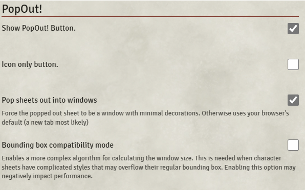

# PopOut!

**Version:** 2.18  
**Used In:** All Worlds  
**Purpose:** Allows character sheets, journals, and other windows to be popped out of the Foundry interface into separate browser windows for improved multi-monitor workflows and layout flexibility.

## Configuration Snapshot

## Configuration Notes

- **Show PopOut! Button:** Enabled to display the PopOut! control on supported windows.
- **Icon only button:** Disabled, so the full label is shown.
- **Pop sheets out into windows:** Enabled to force windowed popouts rather than new browser tabs.
- **Bounding box compatibility mode:** Disabled to avoid unnecessary performance costs unless layout issues arise with specific sheet types.
