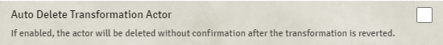

# Portal

**Version:** 2.2.18  
**Used In:** All Worlds  
**Purpose:** Enables seamless token transformations, such as polymorphing a creature into another form (e.g., druid wild shape), with the ability to switch back to the original form. Frequently used in shapeshifting, polymorph, or illusion-based scenarios.

## Configuration Snapshot

## Configuration Notes

- **Auto Delete Transformation Actor:** Disabled to prevent accidental data loss. This ensures a confirmation step is required before removing the transformed actor.
