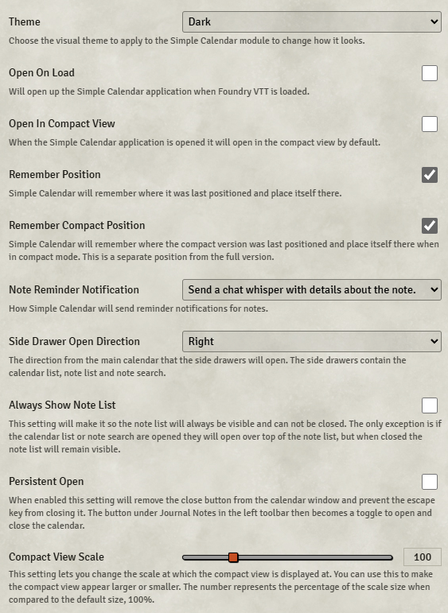

# Simple Calendar

**Version:** 2.4.18  
**Used In:** All Worlds  
**Purpose:** Provides an in-game calendar system with support for custom calendars, timekeeping, moons, seasons, and events. Integrates with weather, lighting, and other modules for immersive worldbuilding and session tracking.

## Configuration Snapshot

## Configuration Notes

- Module is actively used in all worlds to track the in-game date and support immersive storytelling.
- Useful for managing downtime, time-sensitive quests, and seasonal changes.
- The current configuration is tailored to the campaign setting and may include linked moons or custom eras.
