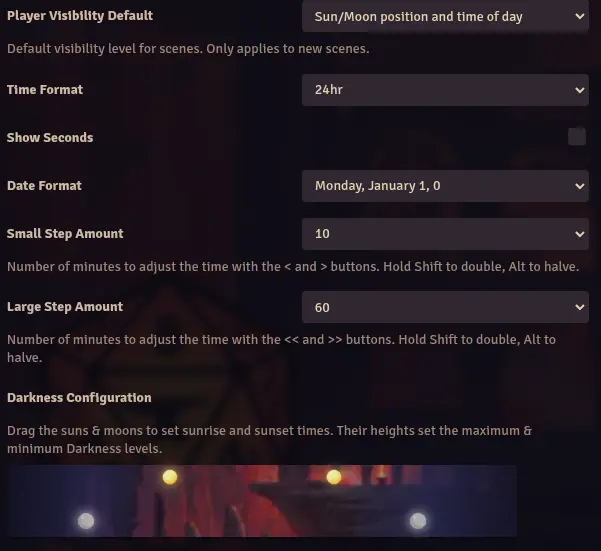
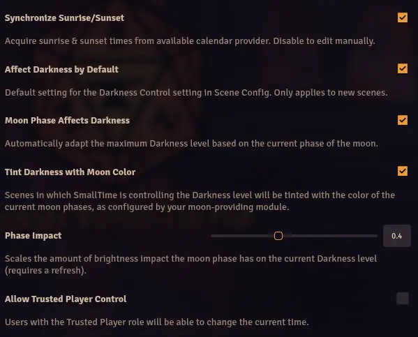

# Small Time

**Version:** 2.0.2
**Used In:**  All
**Purpose:** Provides essential functionality to track time in-game. Can also be used in automation systems to automatically expire Effects. Works with calendar apps to adjust Scene darkness. 

## Configuration Snapshot

## Notes

- None

## Tasks
