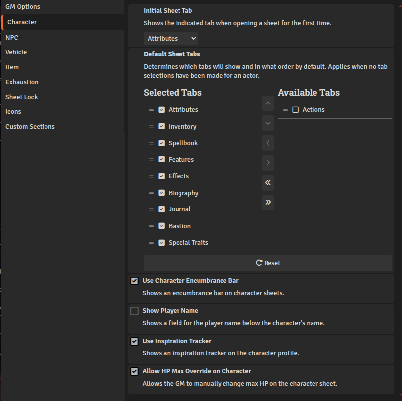
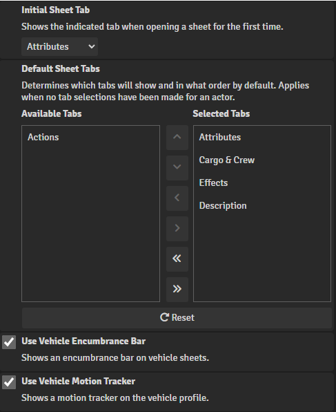
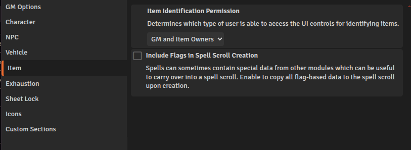
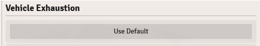
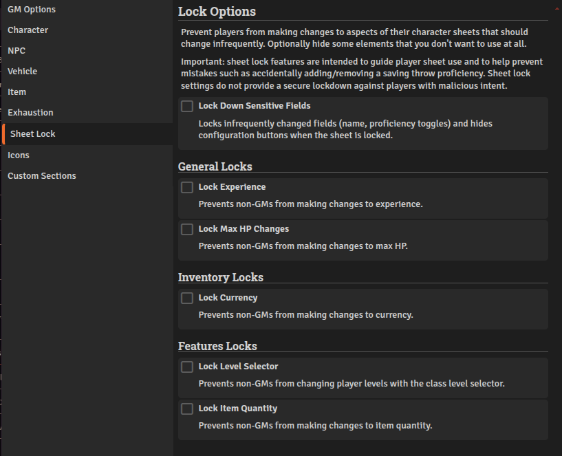
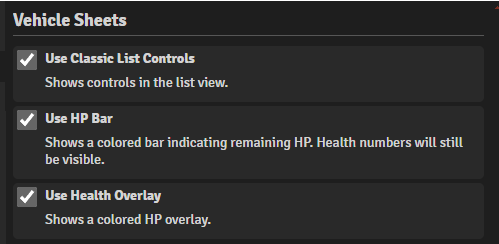
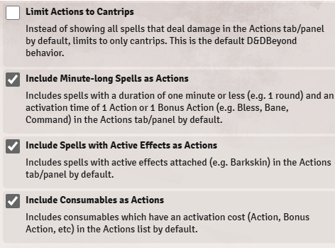
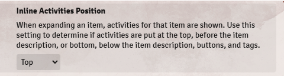
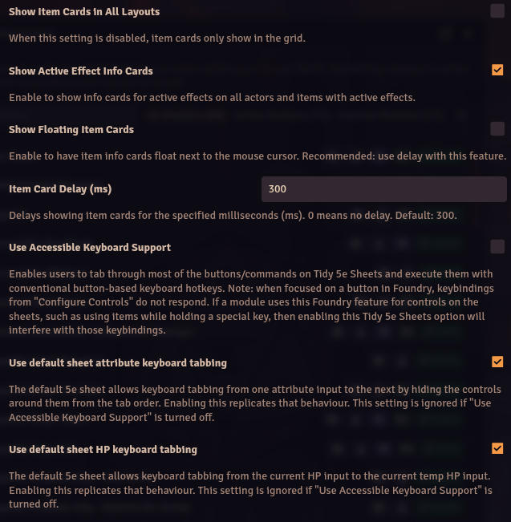
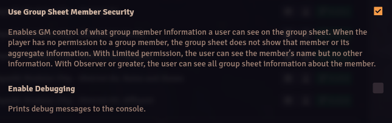

# Tidy 5e Sheets

**Version:** 11.7.1
**Used In:** All Worlds  
**Purpose:** Replaces the default D&D 5e character sheet with a highly customizable and streamlined layout. Improves usability, organization, and aesthetics for characters, NPCs, and vehicles, while also offering expanded GM controls and enhanced visual presentation.

## Configuration Snapshot

  
  
  
  
  
  
  
  
  
  
  
  
  
  
  
  
  

## Configuration Notes

- The module is fully enabled across all actor types: characters, NPCs, and vehicles.
- You use circular portraits and custom tab configurations for different sheet types.
- Useful quality-of-life features are enabled:
  - Health bar and overlay visuals
  - Expanded trait and class displays
  - Support for spell school icons and exhaustion tracking
  - Inspiration glow animation
- GM control settings are enabled to prevent unauthorized edits to HP and sheet selection.
- Tabs like "Journal" and "Biography" are included in most actor types to support roleplaying depth.
- Many layout customizations (like trait positioning, compact UI, and toggle options) are left at default, suggesting current setup is focused on clarity over density.
