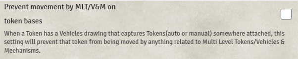

# Token Attacher

**Version:** 4.6.11  
**Used In:** All Worlds  
**Purpose:** Required for legacy Baileywiki content, especially prefabs and maps involving interactive vehicles, multi-token constructs, or attached visual effects. Will be phased out once all content is updated.

## Configuration Snapshot

## Configuration Notes

- The only visible setting is:
  - **Prevent movement by MLT/V&M on token bases:** *Disabled*. Allows attached tokens to still be moved by Multi-Level Tokens or Vehicles & Mechanisms systems if in use.
- No other configuration changes required unless custom attachment behavior is needed.
- Will be deprecated once Baileywiki transitions fully to Levels.

