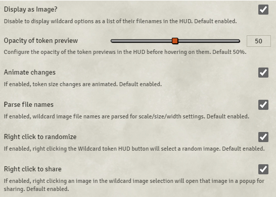

# Token HUD Wildcard

**Version:** 2.1.0  
**Used In:** All Worlds  
**Purpose:** Used to generate randomized token appearances from a set of images for NPCs. This is particularly useful when creating crowds, mobs, or other groups where visual variety adds immersion.

## Configuration Snapshot

## Configuration Notes

This module enables easy management of wildcard tokens. A single Actor with a wildcard image path can be placed multiple times on a map, and each instance will display a randomly selected image from the pool.

This is useful for:
- Creating visually diverse humanoid crowds
- Populating swarms or armies with distinct tokens
- Rapid prototyping without having to create many separate actors

Settings shown here include:
- Image previews and animations are enabled
- File names are parsed to apply scale and size
- Right-click features for randomizing or sharing tokens

Token HUD Wildcard is complementary to **Token Variant Art**, which is used for player-controlled token swaps. While Token Variant Art focuses on character presentation, Token HUD Wildcard excels at visual variety for GMs when populating maps with randomized NPCs.
