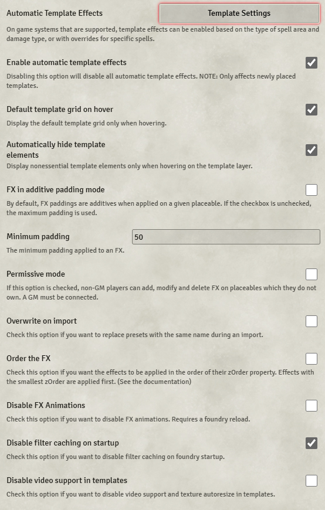

# Token Magic FX

**Version:** 0.6.9  
**Used In:** All Worlds  
**Purpose:** Provides powerful visual effects that can be applied to tokens, templates, and placeables. Commonly used for spell FX (e.g. shimmering shields, glowing auras), special abilities, and immersive spellcasting visuals. Also supports automatic effects on spell templates.

## Configuration Snapshot

## Configuration Notes

- **Enable automatic template effects** is turned on to allow effects to automatically apply when a spell template is placed.
- **Disable filter caching on startup** is enabled to reduce visual glitches on load.
- All other settings are left at default for now.
- Not currently integrated with a macro system, but available for future visual polish or boss FX.

## Recommendation

Keep enabled for enhanced immersion and compatibility with animation modules or future custom effects. Can be reevaluated if performance or module conflict issues arise.
