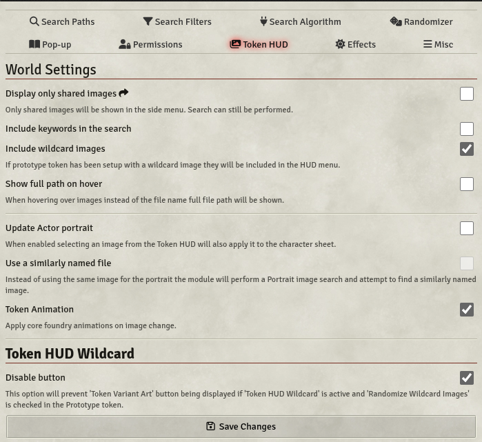

# Token HUD Wildcard

**Version:** 6.1.2
**Used In:** All Worlds, but only if Players want to change the look of their tokens
**Purpose:** Used to allow Players the ability to change the token art used for their character. This is contrasted with Token Variant Art which is used by the GM to drop Wildcard Tokens on the canvas with different art. 

## Configuration Snapshot

## Configuration Notes

NOTE: The only setting changed from Default is "Token HUD Wildcard - Disable Button". There are many options available that are not explored. 

Token Variant Art is complementary to Token HUD Wilcard, which is used by the GM to drop Wildcard Tokens on the canvas. Token Variant Art focuses on character presentation.

## Tasks

- None