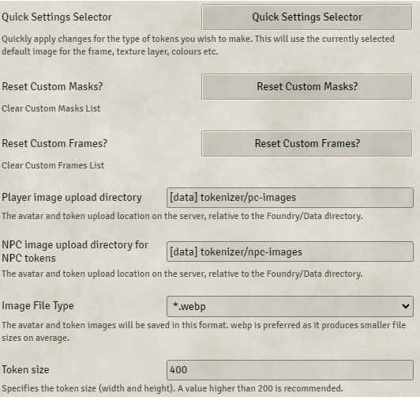
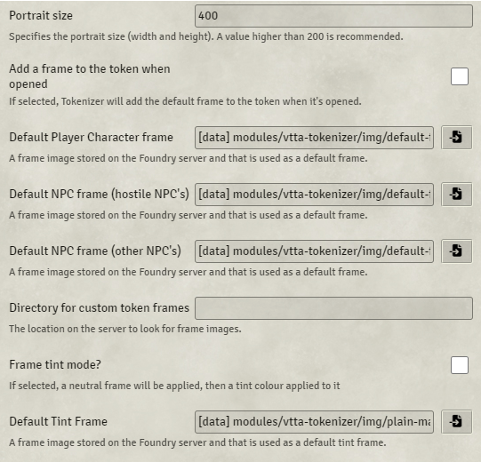
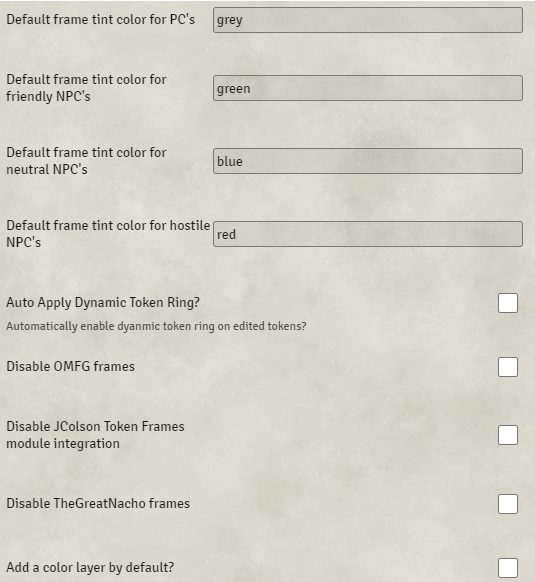
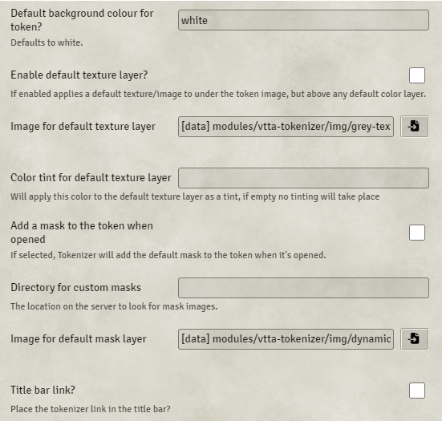
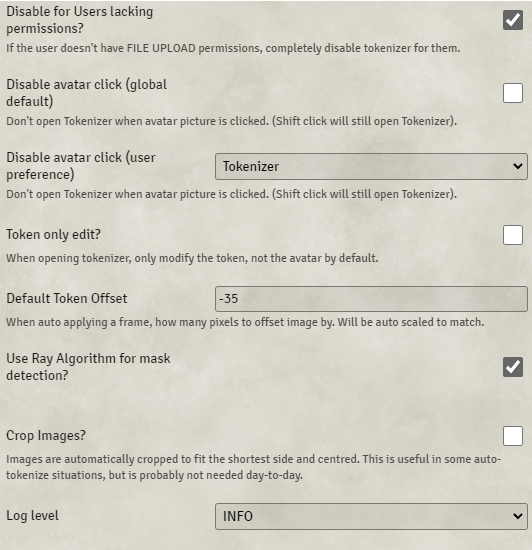
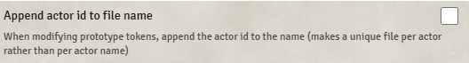

# Tokenizer

**Version:** 4.4.2  
**Used In:** All Worlds  
**Purpose:** Provides a powerful tool for creating custom tokens from character portraits. Allows editing, layering, masking, and framing of tokens directly in Foundry VTT.

## Configuration Snapshot

  
  
  
  
  
  

## Configuration Notes

- Frequently used for creating high-quality custom tokens for both NPCs and PCs.
- Default image file type is `.webp` for efficient size and quality.
- Upload directories are separated for PC and NPC images.
- Frame, mask, and tint options can be customized per token type.
- Ray-based mask detection is enabled for better mask precision.
- Token offset set to -35 to adjust image alignment visually.
- User interface settings ensure that players without permissions cannot launch Tokenizer.
