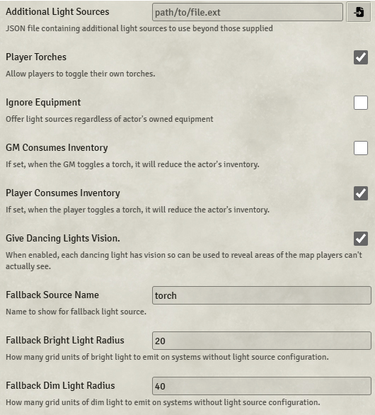

# Torch

**Version:** 2.20.1  
**Used In:** All Worlds  
**Purpose:** Provides a quick toggle for players and GMs to enable or disable torch-like lighting on tokens. Enhances immersion by simulating the effects of lighting equipment like torches and lanterns.

## Configuration Snapshot

## Configuration Notes

- **Player Torches** is enabled, allowing players to toggle their own light sources.
- **Player Consumes Inventory** is also enabled to reduce torch items upon use.
- **Give Dancing Lights Vision** ensures Dancing Lights can reveal map areas, improving usability.
- Fallback lighting values are configured with a bright radius of 20 and a dim radius of 40 units.
- Torch is well-liked by players and is kept active in all worlds.
