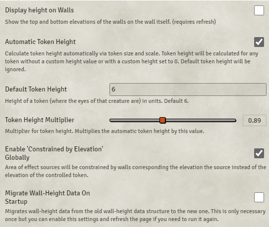

# Wall Height

**Version:** 6.1.2  
**Used In:** All Worlds  
**Purpose:** Enables support for elevation-aware walls and vertical occlusion logic, allowing more accurate simulation of line of sight, sound blocking, and map interaction based on height. Especially useful when paired with the **Levels** module to create rich, vertical, multi-floor environments.

## Configuration Snapshot

## Configuration Notes

- **Automatic Token Height:** Automatically sets a token’s height based on its size, with optional multiplier and override fields.
- **Default Token Height:** Set to `6`, representing the height (eye level) of a medium humanoid creature.
- **Token Height Multiplier:** Set to `0.89` to scale token height slightly below default for improved realism.
- **Enable 'Constrained by Elevation' Globally:** Active—ensures that vision and effect sources obey elevation-based wall constraints.
- **Display Height on Walls** and **Migrate Wall-Height Data** are disabled by default but can be used during map setup or system migration.
